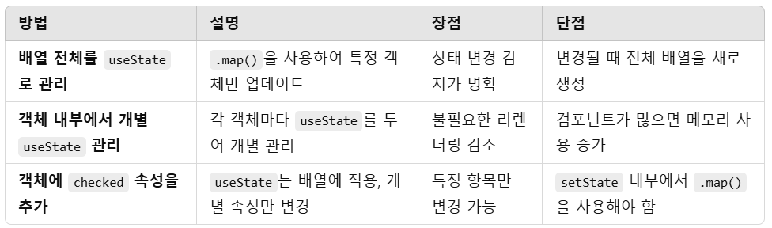

##프로젝트 

- 영화 API를 활용하여 최신 영화 정보를 제공하는 웹 사이트를 구현하였습니다.

##목표 

 - React Router를 사용하여 페이지 간의 동적 탐색 기능을 구현하고 To-Do List 기능을 적용하여 사용자 인터랙션을 향상시키는 연습하고자 합니다.
 - React, API 연동, 상태 관리, 동적 라우팅, 컴포넌트 설계 등 프론트엔드 개발의 핵심 개념을 복습하고 실전 프로젝트 경험을 쌓는 것을 목표로 합니다.

##배운 점 

* 배열 안의 객체를 다룰 때 상태 시점을 잡기 어려움 
React는 상태를 "참조 비교"로 변경을 감지 → 원본 배열을 직접 수정하면 변경을 감지하지 못함.
setState가 비동기적이므로 상태가 즉시 변경되지 않음 → 상태 변경을 연달아 수행할 때 주의가 필요함.
배열에서 특정 항목을 수정할 때 새로운 배열을 생성해야 함 → .map()을 활용해야 React가 변경을 감지하고 렌더링을 트리거함.

🎯결론

✅ 배열 안의 객체를 다룰 때 상태 관리 최적화 방법

🚀 어떤 방식이 가장 좋은가?
객체가 많고, 개별 상태 변경이 적다면? → checked 속성을 추가하는 방식 
객체가 적고, 상태 업데이트를 최적화하고 싶다면? → 개별 객체에서 useState를 관리
최적화를 고려하지 않는다면? → 배열 전체를 useState로 관리하는 기본적인 방식
👉 상황에 맞게 선택하면 된다! 🚀